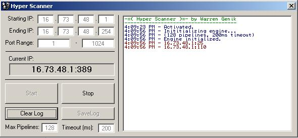



## Hyper Scanner 1\.0 port scanner

### Description

This is designed to be a fast(er) port scanner, configurable (pipelines, timeouts) and automatic (scans Class D or C level ranges). It uses Winsock arrays to make pipelines to test ports. Works very well on a LAN, and has good to excellent success on the Internet, in my testing anyways. The code demonstrates using arrays of controls, etc. This is my first submission to PSCode.com, please enjoy!
 
### More Info
 

             |
---                |---
**Submitted On**   |2004-08-01 16:05:00
**By**             |[W G Info Systems](https://github.com/Planet-Source-Code/PSCIndex/blob/master/ByAuthor/w-g-info-systems.md)
**Level**          |Advanced
**User Rating**    |5.0 (20 globes from 4 users)
**Compatibility**  |VB 6\.0
**Category**       |[Internet/ HTML](https://github.com/Planet-Source-Code/PSCIndex/blob/master/ByCategory/internet-html__1-34.md)
**World**          |[Visual Basic](https://github.com/Planet-Source-Code/PSCIndex/blob/master/ByWorld/visual-basic.md)
**Archive File**   |[Hyper\_Scan177661812004\.zip](https://github.com/Planet-Source-Code/w-g-info-systems-hyper-scanner-1-0-port-scanner__1-55290/archive/master.zip)

